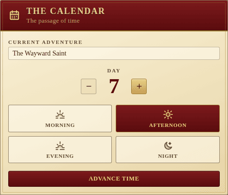

# The Calendar

The Calendar tracks the **current adventure**, the **day** and the **time of
day** the party is in. It sits in the ledger column next to Gold and Fame.

## Fields

- **Current adventure** — a free-text title for the tale the party is
  currently telling. Defaults to "Untitled tale".
- **Day** — a positive integer with `−` / `+` steppers (can't go below 1).
- **Time of day** — one of **Morning**, **Afternoon**, **Evening**, **Night**.
  Each is a toggle button with an evocative icon.

## Advance time

The crimson **Advance time** button at the bottom of the panel rolls the
clock forward one phase. When the time is already **Night**, advancing wraps
around to **Morning** and increments the day.

The Party's **Long rest** action also drives the calendar: it pushes the
clock to the next morning and increments the day, so a rest in the wilds is
a single tap, not two.

Like every other panel, edits are persisted to the backend and broadcast in
real time, so the whole table sees Day 7 turn into Day 8 at the same moment.
