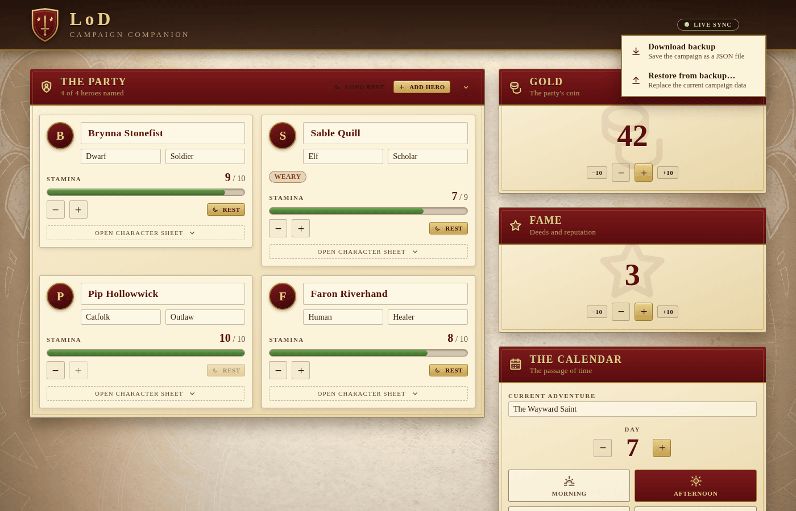

# Campaign menu — backup & restore

The header carries a small **campaign menu** with the heaviest off-table
chores: getting the whole campaign out of the app and back into it later.

## Download backup

**Download backup** bundles every panel — party, gold, fame, calendar,
quests, people, keywords and the chronicle — into a single JSON file and
saves it to your downloads folder. Names include the day so consecutive
backups don't clobber each other.

## Restore from backup

**Restore from backup** opens a file picker. Pick a previously-downloaded
JSON and the app reads each panel back, broadcasting the result so every
connected player's screen catches up at once.

The restore is **idempotent and channel-by-channel** — if the file is missing
a panel's data, that panel is left alone rather than wiped. That makes
partial restores safe.

## Connection badge

Next to the menu sits a small **connection badge** that turns amber when
the realtime link has dropped. A toast also fires on disconnect ("Your
edits are kept locally until the link returns") and on recovery ("Realtime
sync has been restored"), so the table never wonders whether updates are
actually being shared.
