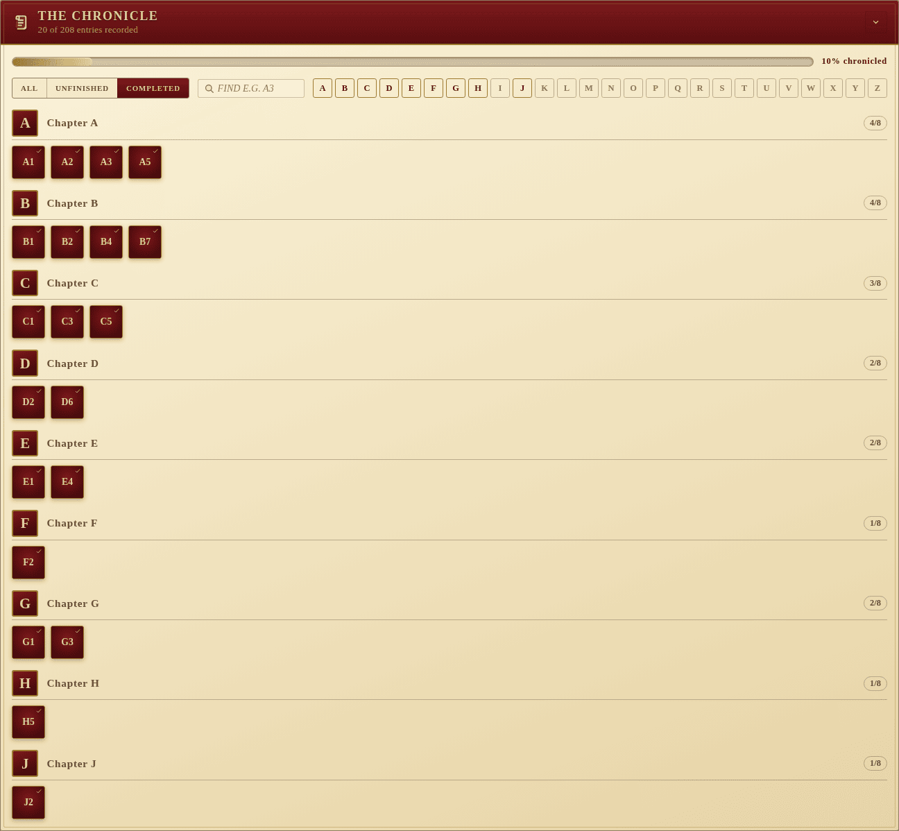

# The Chronicle

The Chronicle is the campaign's spine: the **A1 to Z8** grid of numbered
story entries that *Legacy of Dragonholt* uses to thread its branching tale.
Each entry is either read-and-resolved or still untouched, and the party's
progress through the chronicle is the campaign's pace.

## What you can do

- **Tap an entry** to toggle it between unread and chronicled. A check mark
  appears on chronicled entries and the chapter's `done / 8` counter
  updates.
- **Track overall progress** via the filled bar across the top — it shows
  the percentage chronicled.
- **Filter** to **All / Unfinished / Completed** with the chips at the
  top-left. The screenshot above is the Completed view.
- **Find an entry** by typing a label like `A3` into the search box. Only
  matching entries remain visible.
- **Jump to a chapter** through the A–Z nav strip. Each letter is colour-coded
  by progress: faded for empty chapters, gold for partial, crimson for
  completed.

## Chapter sections

Below the controls the entries are grouped into chapters, one per letter.
Each chapter has its own header with the letter, the chapter name, and a
`done / 8` count, followed by the eight entry tiles.

## A1–Z8

The grid is **always rebuilt at load time** from the canonical 26 × 8 layout,
overlaying any saved `isDone` flags by label. That means partial or legacy
saves (the original generator skipped the letter "T") are migrated onto a
well-formed grid with no missing slots — your story state survives upgrades.
