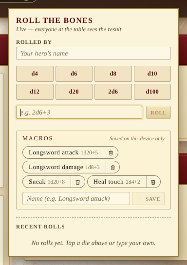

The dice roller lives in the app header, between the connection badge and the
campaign menu. Tap the **d20** icon to open it.

Every roll is **broadcast over Socket.IO to every connected player** — so when
the GM rolls a fortune die or a player calls a skill test, the whole table
sees the same dice and the same total.

## Quick rolls

A grid of one-tap buttons covers the common dice: **d4, d6, d8, d10, d12,
d20, 2d6, d100**. Each tap rolls once and prepends a new entry to the log.

## Custom expressions

The text field below the quick grid takes standard dice notation:

- `d20` &nbsp;— one d20
- `2d6+3` &nbsp;— two d6 plus a flat 3
- `d20-1` &nbsp;— one d20 with a -1 penalty
- `3d4+2d6+1` &nbsp;— mixed groups join together
- `D20 + 2` &nbsp;— whitespace and case are tolerated

Bad input (`hello`, `0d6`, ...) surfaces a toast instead of a roll.

## Macros

Repeated rolls — _Longsword attack_, _Sneak_, _Healing touch_ — don't
need to be retyped. Type an expression in the custom-roll field, give
it a **name** below, and tap **Save**: the macro shows up as a one-tap
pill in the **Macros** strip and rolls the saved expression on a
single click.

Macros are stored under the per-device preference namespace in
`localStorage`. They survive reloads but are **device-local** — they
are not part of the shared campaign state and are not included in the
campaign backup file. Re-saving an existing name overwrites the
expression rather than piling up duplicates, and the strip caps at
twelve to keep the popover tight. The trash icon on each pill removes
it.

## Rolled by

The **Rolled by** field carries the player's name into every roll they make
and is remembered across reloads. Leave it empty and your own rolls show as
"You"; everyone else's nameless rolls show as "Stranger".

## The log

The most recent twenty rolls are kept on every device. Each entry shows the
roller, the expression, the individual dice, any modifier, and the total.
On a d20 a **natural 1** or a **natural 20** is highlighted so a crit or a
botch is hard to miss.

Hovering an entry reveals a **Re-roll** shortcut that repeats the same
expression — useful when a skill test calls for "roll again, take the worst".
**Clear** wipes the local log; it does not affect anyone else's.

## Realtime experience

When a peer rolls while your popover is closed, the dice icon shakes
briefly and a toast announces who rolled what. Open the popover to see the
detail.
