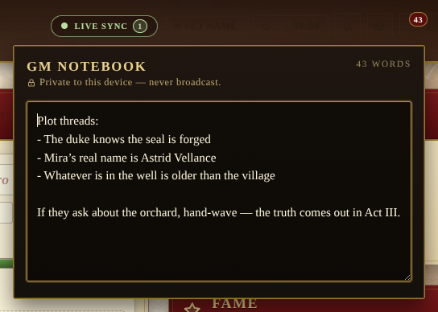

# GM notebook

A private scratchpad for the storyteller. Hidden NPCs, secret rolls,
plot threads, anything the table shouldn't see — kept local to the
device that wrote it. Distinct from the Journal, which is the shared
session log every player can see.

## How it stays private

- The notebook is stored under the **per-device preference namespace**
  in `localStorage` (`lod:pref:gm-notebook`), the same namespace used
  for which panels you keep collapsed and which theme you picked.
- Nothing is sent to the backend. No POST, no Socket.IO broadcast,
  no Chronicle entry. Other connected players never see the contents,
  and the campaign backup file does not include it either.
- A small lock icon and the line _"Private to this device — never
  broadcast"_ are pinned to the popover so it's obvious at a glance.

## Workflow

- Click the **lock icon** in the header to open the drawer. The trigger
  shows a small crimson badge with the current word count whenever the
  notebook has anything in it.
- Type freely — every change is autosaved on a 400ms debounce, so a
  long typing burst writes once at the end rather than on every
  keystroke.
- A live word counter sits in the top-right of the drawer.
- **Escape** or a click outside closes the drawer; the content is
  already persisted.

## Note on device hygiene

Because the notebook lives in `localStorage`, **clearing site data or
switching browsers loses the notes**. If you regularly run sessions
from more than one device and want shared GM notes, use the public
Journal panel instead, or copy the text out into a separate file
before clearing browser data.
