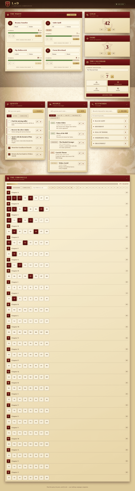

The campaign companion is built as a grid of panels — each one focused on a
single aspect of an LoD campaign. They all share a parchment-and-crimson
visual style, can be collapsed independently, and update in real time across
every connected screen.

The pages below walk through each panel in turn:

- [The Party](party.md)
- [Treasury — Gold & Fame](treasury.md)
- [The Calendar](calendar.md)
- [Quests](quests.md)
- [People](people.md)
- [Locations](locations.md)
- [Keywords](keywords.md)
- [The Chronicle](chronicle.md)
- [Dice roller](dice-roller.md)
- [Ambient soundscape](soundscape.md)
- [GM notebook](gm-notebook.md)
- [Campaign menu — backup & restore](campaign-menu.md)
- [Session recap](session-recap.md)
