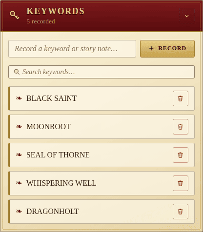

# Keywords

Keywords are the **story tokens** that *Legacy of Dragonholt* sprinkles
through its prose: cryptic words that unlock new entries elsewhere in the
book. The Keywords panel is where the party logs them as they are found.

## Adding

Type a keyword into the entry field and press **Enter** or **Add**. The
panel preserves capitalisation — the rulebook style is all-caps tokens like
**BLACK SAINT** or **WHISPERING WELL**, and we keep them that way.

## Searching

The search box above the list filters by case-insensitive substring, so a
quick `well` is enough to find **WHISPERING WELL** in a long list later in
the campaign.

Each entry has a **trash** button to remove it once an arc is resolved.

## Migration

Older saves that stored plain strings are upgraded into the current
`{ id, text }` shape automatically.
