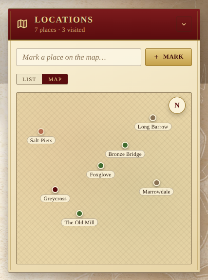

The Locations panel is the party's map ledger — the towns, ruins and
landmarks the tale has touched, whether they've been visited or are only
rumour. It sits in the notebook row alongside Quests, People and Keywords.

## Per-entry fields

- **Name** — required.
- **Status** — one of **Rumored**, **Visited**, **Home**, **Lost**. The
  status drives the colour of the side stripe and the chip in the header
  so the map reads at a glance.
- **Region** — the wider kingdom or wilderness the place belongs to.
- **Notes** — what's there, who lives, what waits.

## The status arc

Clicking the inline status chip cycles it forward in a natural arc:

`Rumored → Visited → Home → Lost → Rumored…`

So a place starts as something the party has merely heard about, becomes
**Visited** after the heroes set foot on it, can be promoted to **Home**
when it is a haven they return to, and falls to **Lost** when the road
has carried them away. The cycle wraps back to **Rumored**.

## Map view

A **List / Map** toggle just under the input flips between the existing
list and a hand-drawn parchment map. Each location becomes a coloured
pin (rumored / visited / home / lost) at its `{x, y}` percentage on the
canvas. Clicking a pin pops up the place's full details — status,
region, notes — without leaving the map.

Pins are **draggable**: hold and drag to reposition. The new coords are
saved on the location record itself, broadcast like any other change,
and persisted in the campaign backup. Locations that don't yet have
coords get tidy grid slots so a fresh map is at least glanceable; the
moment you drag a pin, its position becomes persistent.

The active view is remembered per device under
`lod:pref:locations-view`, so opening the app on a phone won't override
your laptop's choice.

## Filters

A row of status chips filters the list to a single status at a time, with
the total per status in the chip itself (`VISITED 3`, `HOME 1`, …). The
overall count — and the number of visited places — sits in the panel
subtitle.

## Adding and editing

The **Mark a place on the map…** field accepts a name; **+ Mark** opens a
fuller editor where status, region and notes can be filled in. Each row
has a **pencil** to re-edit and a **trash** button to forget.

Like the rest of the campaign, every change is broadcast to other players
in real time, and the panel is included in the campaign backup.
