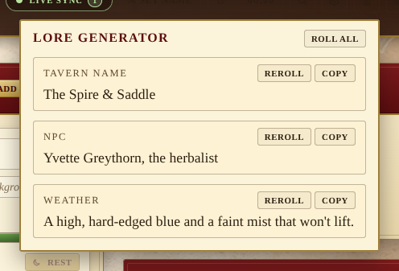

# Lore generator

A small idea-machine for whoever's running the table. Click the scroll
in the header to roll a fresh **tavern name**, **NPC** and **weather
report** — and reroll any one of them on its own.

## What it produces

| Generator | Shape |
| --- | --- |
| **Tavern name** | An inn or tavern name in one of several frames: _The Crooked Crow_, _The Spire & Saddle_, _The Velvet Lantern Inn_, _Iron Drake Tavern_. |
| **NPC** | A first name, a last name and a one-line role: _Mira Highstone, the herbalist_; _Bram Ashfield, the disgraced knight_. |
| **Weather** | A two-clause weather sentence built from a sky and a ground: _A flat grey sky with mud halfway to the knee._ |

## Workflow

- **Roll all** at the top of the popover rerolls every generator at once.
- Each row has its own **Reroll** for one-at-a-time tweaking.
- **Copy** drops the result onto the clipboard so it can be pasted into the
  matching panel (NPCs, Locations, Chronicle entry, etc.) without any
  cross-panel coupling. The button flashes "Copied" for ~1.4s.

## Extending the tables

Tables live in `src/utils/loreGenerator.js` as plain arrays of strings —
`TAVERN_QUALIFIERS`, `TAVERN_SUBJECTS`, `NPC_FIRST`, `NPC_LAST`,
`NPC_ROLES`, `WEATHER_SKY`, `WEATHER_GROUND`. Adding new entries is one
line each; the generator picks uniformly with `Math.random()`. A custom
RNG can be passed for deterministic tests (see
`src/utils/loreGenerator.test.js`).
