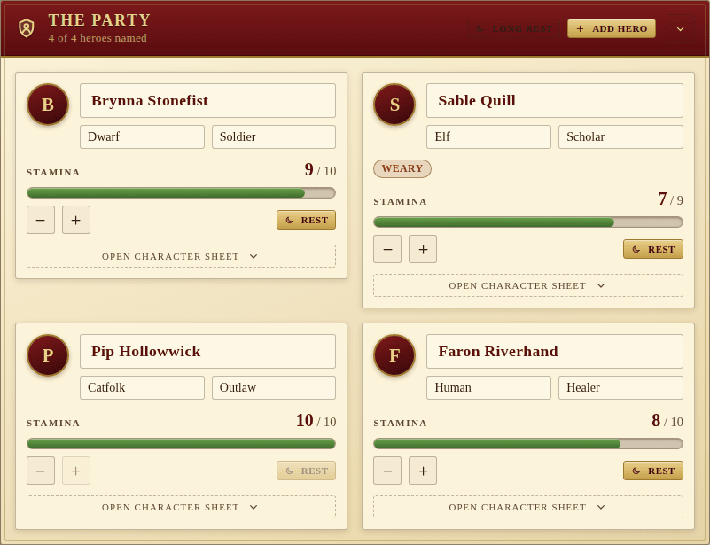
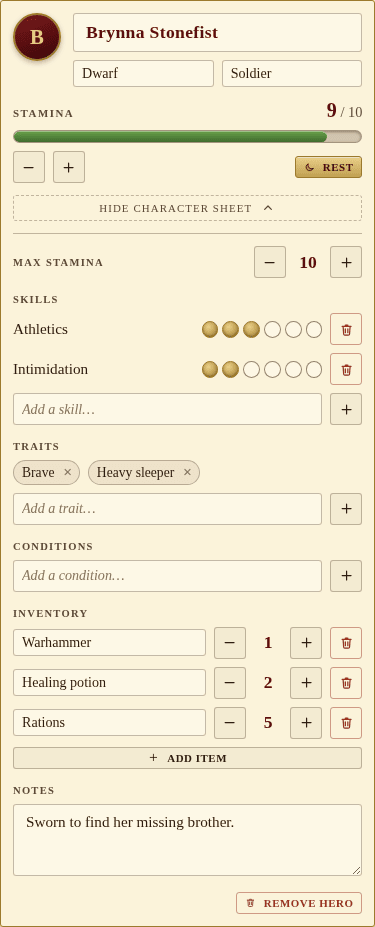

The Party panel holds the heroes that the players have brought to the table.
Up to **six** characters fit, and the panel seeds itself with four blank
cards so a new campaign is ready to be filled in.

Each card shows the essentials at a glance: a name, a species and background,
any **conditions** the hero is suffering, and a stamina bar. The bar's `−`
and `+` step a single point at a time; the **Rest** button on a card brings
that one hero back to full strength.

## The character sheet

Tap **Open character sheet** on any card to unfold the full sheet — skills
with their rank dots, traits, conditions, inventory and notes.

- **Stamina** — `current / max`, edited with `−` / `+`, with a dedicated max
  stepper inside the sheet.
- **Skills** — free-text names with a 1–6 rank dot tracker.
- **Traits** and **Conditions** — chip editors. Conditions render in a warning
  tone so an injured or rattled hero stands out at a glance.
- **Inventory** — name + quantity rows; the stepper handles stacks.
- **Notes** — a roomy textarea for bonds, scars and secrets.

Species, background and skill names come with **datalist suggestions** drawn
from the Legacy of Dragonholt rulebook, but any free-text value is accepted.

## Top-of-panel actions

- **Long rest** — restores every wounded hero to full stamina and advances
  the calendar to the next morning. Disabled while the party is already at
  full strength.
- **Add hero** — appends a new blank card (up to the cap of six).

## Realtime behaviour

Every edit is saved against the shared campaign channel and broadcast to all
other connected screens. The originating client ignores its own echo to avoid
input flicker while typing.
