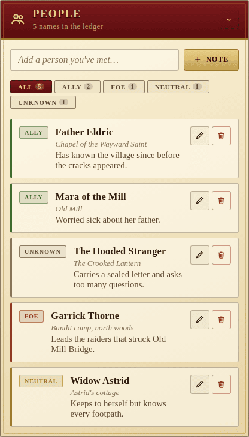

The People panel is the party's social ledger — the villagers, strangers
and adversaries the heroes have met along the way.

## Per-entry fields

- **Name** — required.
- **Role** — one of **Ally**, **Foe**, **Neutral**, **Unknown**. The role
  drives the colour of the side stripe and the chip in the header, so the
  cast reads at a glance.
- **Location** — where they were last known to be.
- **Notes** — short prose: what they want, what they know, what they hide.

## Filters

A row of role chips filters the list to a single role at a time, with the
total per role in the chip itself (`ALLY 2`, `FOE 1`, ...). The full count
sits in the panel subtitle.

## Adding and editing

The **Add a person you've met…** field accepts a name; **+ Note** opens a
fuller editor where role, location and notes can be filled in. Each row has
a **pencil** to re-edit and a **trash** button to forget.

Like the rest of the campaign, every change is broadcast to other players in
real time.
