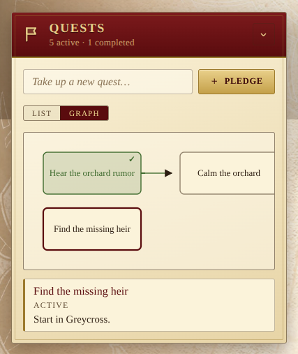

The Quests panel is the party's writ — the list of errands they have
pledged to see through. Each quest carries a title, optional notes, and an
active/completed state.

## Adding and editing

Type a title into the **"Take up a new quest…"** field and press **Enter**
or **Pledge** to add it. Each entry can be expanded into an editor that lets
you rewrite the title and add longer **notes** — details, hooks, gossip — on
a second line. Empty titles are rejected; submitting an empty edit cancels.

## Graph view

The **List / Graph** toggle just under the input swaps the writ for a
left-to-right DAG of the quests, drawn from their **dependsOn** edges
that the list-view editor already exposes. Roots sit on the leftmost
column; each child quest moves one column past the deepest of its
prerequisites.

- **Green** node — completed quest.
- **Solid** node — active and ready to take up.
- Clicking a node opens a small detail panel below the canvas with the
  quest's title, status (Active / Completed) and notes.
- The view is **read-only**; editing still happens in the list view to
  keep the graph uncluttered.

### Locked quests stay hidden

A quest with at least one **open prerequisite** is **not drawn at all**
— neither as a card nor as a destination for an arrow. The graph only
shows what the table already knows about, matching how the Legacy of
Dragonholt book itself reveals paragraphs only after they're unlocked.
The moment a prerequisite is marked done, the newly-unlocked quest
appears in its column with the edge from its parent in tow.

If you want a retrospective overview of the whole writ after the
campaign — including everything that was once locked — the list view
already shows every quest, dependencies and all.

The active view is remembered per device under `lod:pref:quests-view`.

## Filters

The three filter chips above the list scope what's shown:

- **All** — every quest, open or closed.
- **Active** — only outstanding pledges.
- **Completed** — only finished quests.

Each entry also has a per-row **checkbox** (mark done / undo) and a **trash**
button to remove it. The subtitle of the panel keeps a running count
(`<n> active · <m> completed`).

## Migration

Older saved data with bare quest strings is upgraded on read into the modern
`{ id, title, notes, isDone }` shape, so you never lose work from earlier
versions of the app.
