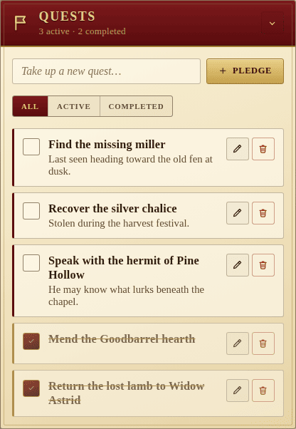

The Quests panel is the party's writ — the list of errands they have
pledged to see through. Each quest carries a title, optional notes, and an
active/completed state.

## Adding and editing

Type a title into the **"Take up a new quest…"** field and press **Enter**
or **Pledge** to add it. Each entry can be expanded into an editor that lets
you rewrite the title and add longer **notes** — details, hooks, gossip — on
a second line. Empty titles are rejected; submitting an empty edit cancels.

## Filters

The three filter chips above the list scope what's shown:

- **All** — every quest, open or closed.
- **Active** — only outstanding pledges.
- **Completed** — only finished quests.

Each entry also has a per-row **checkbox** (mark done / undo) and a **trash**
button to remove it. The subtitle of the panel keeps a running count
(`<n> active · <m> completed`).

## Migration

Older saved data with bare quest strings is upgraded on read into the modern
`{ id, title, notes, isDone }` shape, so you never lose work from earlier
versions of the app.
