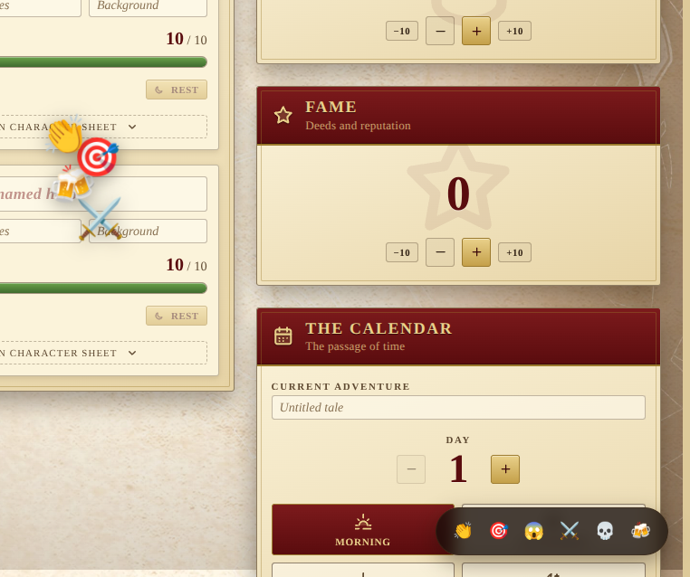

# Reactions

Quick table-side reactions every player at the table can see and react
to in turn. No persistence, no log entry — purely a way for everyone
around the screen to clap, cheer, gasp, or react to that critical hit
without breaking the flow of the game.

## How it works

- A rounded pill of six buttons sits in the bottom-right corner —
  **applause**, **critical hit**, **oh no**, **battle**, **down they
  go**, **cheers**.
- Tapping one fires off an emoji that floats up the screen for about
  two seconds, then disappears.
- Every other connected player sees the same emoji rise on their own
  screen, with a small horizontal drift so a flurry of identical
  reactions stays legible instead of stacking into a column.

## Why it's ephemeral

Reactions are deliberately not stored. The server's `reaction:send`
relay only validates that the payload carries a short emoji string,
stamps it with the originating socket id, and broadcasts to every
connected client. There's no MongoDB write, no socket reconnect replay,
no entry in the Chronicle. The only state is a short-lived array in
each client's `Reactions` component, which evicts entries after the
animation completes.

## Accessibility

Each button carries an `aria-label` (e.g. "Applause", "Critical hit")
so screen readers announce the intent rather than the raw emoji. The
flying field itself is `aria-hidden` — reactions are noise, not
narrative — and the animation collapses to a static fade under
`prefers-reduced-motion`.
