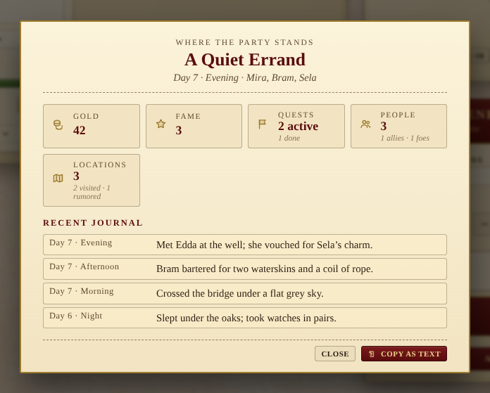

# Session recap

A one-screen "where the party stands" view, opened from the campaign
menu. Stat cards for the panels that move (gold, fame, quests, people,
locations), the most recent journal entries, and a **Copy as text**
button that drops a plain-text handout onto the clipboard — handy for
pasting into the table's group chat at the end of the night.



## What it shows

- **Adventure title and where**: the current adventure name from the
  calendar, the current day and time of day, and the named heroes in
  the party.
- **Stat cards**: gold, fame, quests (active / done), people (total /
  allies / foes), locations (total / visited / rumored).
- **Recent journal**: the six most recent journal entries with their
  day-and-time stamps and full text.

## Copy as text

The **Copy as text** action assembles a clean Markdown-ish handout:

```text
# A Quiet Errand
Day 7, Evening
Party: Mira, Bram, Sela

Gold: 42    Fame: 3
Quests: 2 active, 1 done
People: 3 total (1 allies, 1 foes)
Locations: 3 total (2 visited, 1 rumored)

Recent journal:
- Day 7, Evening — Met Edda at the well; she vouched for Sela's charm.
- Day 7, Afternoon — Bram bartered for two waterskins and a coil of rope.
- ...
```

The button briefly flashes "Copied" so you know it landed on the
clipboard.

## How it's wired

- The recap reads from the existing channels (`calendar`, `gold`,
  `fame`, `heroes`, `quests`, `npcs`, `locations`, `journal`) — there
  is **no new persistence**. It's a derived view, recomputed on each
  open.
- The summarisation lives in a pure
  `summariseRecap({...}) → { adventure, day, timeLabel, party, counts,
  recentJournal }` helper alongside `recapToText(recap) → string`, so
  the maths can be unit-tested without rendering.
- The dialog is portalled to `<body>` so the fixed backdrop fills the
  viewport instead of being clipped by the campaign-menu container's
  stacking context.
