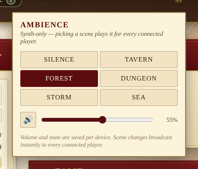

# Ambient soundscape

A small ambience picker in the header. Pick a scene — _Tavern_,
_Forest_, _Dungeon_, _Storm_, _Sea_ — and every connected player at the
table hears the same backdrop. _Silence_ stops it.

## How the audio is made

There are **no audio assets in the repo.** Each scene is a procedural
recipe built from Web Audio nodes:

| Scene | Recipe |
| --- | --- |
| **Tavern** | Brown noise → band-pass at ~360Hz with a slow LFO on the centre frequency, so the murmur swells like a room of people. |
| **Forest** | Pink noise → low-pass, with the occasional chirp synthesised as a short sine sweep. |
| **Dungeon** | Brown noise → tight low-pass at ~220Hz, plus a periodic synthesised water-drip. |
| **Storm** | Pink noise through a high-pass + low-pass pair, with an LFO on the low-pass cutoff so the rain breathes. |
| **Sea** | Brown noise → low-pass at ~800Hz with a slow LFO on the swell gain to imitate waves rising and falling. |
| **Silence** | Stops the current scene with a 0.6s fade-out. |

The crossfade between scenes is 0.8s so transitions never click or
crunch.

## Sync model

- Picking a scene emits `soundscape:set` over Socket.IO. The server
  validates the payload and relays to every connected client. No
  persistence, no Chronicle entry — same pattern as dice rolls and
  reactions.
- The local origin is filtered out so the sender doesn't re-trigger
  itself when its own broadcast bounces back.
- A new tab joining mid-session **doesn't** auto-play the active scene
  — the server only relays new changes. (This is by design: browsers
  block audio without a user gesture, so the joiner picks something
  themselves once they're at the keyboard.)

## Volume and mute

Volume and mute are **per-device**. They live under the per-device
preference namespace in `localStorage` (`lod:pref:soundscape-volume`
and `lod:pref:soundscape-muted`), survive reloads, and aren't part of
the campaign backup.

## Why no audio files?

- Nothing to license, nothing to fetch, nothing to keep the bundle
  small around.
- Adding a new scene is one function in `src/utils/soundscape.js`.
- The synth is intentionally crude — the goal is "something suggestive
  at low volume", not realistic foley. If you want real ambience for a
  big session, route the same Bluetooth speaker from Spotify alongside.
