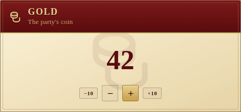
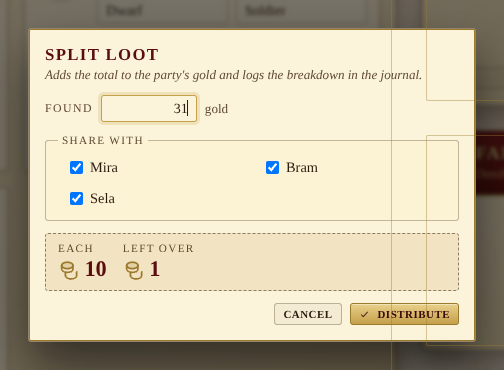
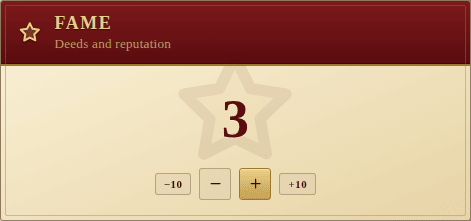

Two slim panels in the ledger column track the party's wealth and renown.

## Gold

A single counter for the party's coin. The big number in the middle of the
parchment is the current total; the `−` and `+` buttons step by one. The
counter accepts any whole number and is shared across every connected
screen.

### Split loot…

Below the counter, **Split loot…** opens a small dialog for handing out
treasure after a fight or a chest. Type the total, untick anyone who isn't
sharing, and the preview shows the per-hero cut and the remainder.

Hitting **Distribute**:

- adds the total to the party's gold counter (the shared pool), and
- writes a single journal entry stamped with the current day and time of
  day, e.g. _"Split 31 gold: 10 each to Mira, Bram and Sela; 1 left to
  the party kitty."_

The remainder (`total % heroes`) stays in the kitty rather than vanishing
or being assigned arbitrarily, so the breakdown is always reconcilable.

## Fame

Fame mirrors the shape of Gold — one counter, two steppers — but tracks
**renown**: the deeds the party is becoming known for. The number ticks up
as villagers spread word of a routed bandit, a healed hearth, a found heir.
